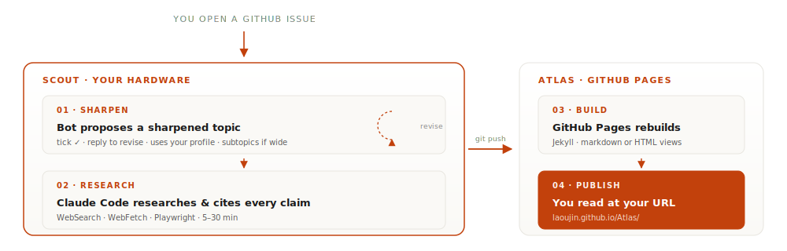

<table>
  <tr>
    <td width="220" align="center">
      
    </td>
    <td>
      <h1>Scout</h1>
      <h2>Personal research engine</h2>
      <p>Open a GitHub Issue → Claude researches on your hardware → cited
      result published to your own Jekyll site via GitHub Pages.</p>
      <p>
        <a href="https://laoujin.github.io/Scout/">Landing page &amp; config picker</a>
        · <a href="https://laoujin.github.io/Atlas/">Example Atlas</a>
      </p>
    </td>
  </tr>
</table>

## What it is

<p align="center">
  
  <br>
  <sub>or see the <a href="https://laoujin.github.io/Scout/#how">full branched flow</a></sub>
</p>

Three repos, one flow:

-  **Scout** — this repo. Self-hosted GitHub Actions runner + research workflow + skill pack. Forked to your account.
-  **[Atlas](https://github.com/Laoujin/Atlas)** — your publishing target. Jekyll site, themed via three config values (`skeleton` / `palette` / `card`). Built by GitHub Pages.
-  **[Compass](https://github.com/Laoujin/Compass)** — the Jekyll theme. Lives as a submodule of Atlas at `compass/`; supplies layouts, CSS, and the `skeleton` / `palette` / `card` knobs. You only touch this if you want to tune the look.

**Requires:** Claude Code subscription, Docker, a GitHub account, an always-on
Linux host (a mini-PC, NAS, or spare laptop). No API key — Scout runs inside
your Claude subscription.

## Install

### One-liner

```bash
curl -fsSL https://raw.githubusercontent.com/Laoujin/Scout/main/install.sh \
  | bash -s -- --config=s5.cartography.v1
```

Pick your `<skeleton>.<palette>.<card>` with
[the picker](https://laoujin.github.io/Scout/#your-atlas)
or go with `s5.cartography.v1`. 
You can change it any time by editing `_config.yml` in your Atlas repo.

- `skeleton`: overall site layout (s1 -> s6)
- `palette`: Colour scheme (ex: cartography, midnight, nord, ...)
- `card`: Research card style (v1 -> v7)

**What the installer does:**

- Forks Scout to your account.
- Creates your Atlas repo ([Compass](https://github.com/Laoujin/Compass) as the theme submodule, GitHub Pages enabled, deploy key uploaded).
- Registers a self-hosted runner and writes its token to `docker/.env`.

Then two manual steps:

```bash
# Start the GitHub action workflow runner
cd Scout/docker && docker-compose up -d --build

# one-time login with your Claude Code subscription
docker exec -it scout-runner runuser -u runner -- claude
```

Don't want to pipe strangers into `bash`? See [INSTALL.md](INSTALL.md) for the manual step-by-step. Extra installer flags (`--org`, `--dir`, `--ref`, …) are documented at the top of `install.sh`.

### Identity profile (optional)

Scout can localize and contextualize sharpening with `profile.yml` in your Scout fork (gitignored). The installer creates an empty skeleton. Set `location`, `languages`, `currency`, and `interests` to steer "best ramen" → "best ramen in Ghent, EUR" automatically. See [`profile.example.yml`](profile.example.yml).

## Usage

### Open a research Issue

[Open a new Issue](https://github.com/Laoujin/Scout/issues/new?template=research.yml) using the **Research request** template. Fill in `Topic` and `Depth`.

Scout replies with a sharpened proposal plus a `- [ ] **Start research**` checkbox.

- **Tick the checkbox** → research runs, publishes to Atlas, comments the link back.
- **Reply with feedback** ("focus on r/homelab", "shorter, decision-only") → Scout posts a revised proposal as a new comment. Loop until happy -- or edit the comment directly.
- **Multi-angled expeditions** are decomposed automatically: sharpening proposes 2-8 sub-topics, each runs as its own expedition in parallel, and an overview page links them. Each sub-topic is optional, as is decomposition.
- **Bespoke HTML views**: After publishing to Atlas, Scout proposes which pages would benefit from a one-off styled treatment (magazine, manifesto, …) which sits next to the existing markdown.


### `/scout` slash command

Open Scout Issues from inside Claude Code:

```bash
bash commands/install-scout-command.sh <you>/Scout https://<you>.github.io/Atlas/
```

`install.sh` also offers this at the end — but it installs on the always-on machine where it ran.

Then, in any Claude Code session:

```txt
/scout Compare the top 3 static site generators in 2026
```

## Depth tiers

`Depth` controls how Scout researches:

| Depth        | Output                     | Mechanism                         | Wall-clock |
|--------------|----------------------------|-----------------------------------|------------|
| `recon`      | One-page decision brief    | Single pass, inline citations     | ~2-5 min   |
| `survey`     | 2-4 page balanced overview | Single pass + reflect-and-requery | ~5-10 min  |
| `expedition` | All-angle long-form        | Parallel sub-agents + post-review | ~15-60 min |

See [`skills/scout/SKILL.md`](skills/scout/SKILL.md) for per-tier behaviour and [`skills/scout/deep.md`](skills/scout/deep.md) for the expedition flow.

## Theme Tinkering

Themes live in [Compass](https://github.com/Laoujin/Compass) and are picked via three knobs in your Atlas's `_config.yml` (`skeleton` / `palette` / `card`). Clone Compass and run its `serve.ps1` to preview every variant of one axis side-by-side — see the [Compass README](https://github.com/Laoujin/Compass#preview-every-variant-at-once).

Pull layout updates into your Atlas:

```bash
cd Atlas && git submodule update --remote compass && git commit -am "bump compass" && git push
```

## Operate

Day-to-day maintenance — updating Scout/Claude, re-authenticating, rotating the runner token — lives in [`docs/OPERATE.md`](docs/OPERATE.md).


## Troubleshooting

- **Runner offline** → `docker logs scout-runner`; `docker-compose restart`.
- **Runner won't register** → token probably expired. See [Rotate runner token](docs/OPERATE.md#rotate-runner-token).
- **Push to Atlas fails** → `docker exec scout-runner runuser -u runner -- ssh -T github.com-atlas` should greet you. If not, the deploy key is wrong or missing write access. Re-do step 5 + 6 of [INSTALL.md](INSTALL.md).
- **Claude auth expired** → see [Re-authenticate Claude](docs/OPERATE.md#re-authenticate-claude).
- **Jekyll preview build fails** → delete `compass/_previews/` and `compass/_site/`, retry. Jekyll caches are not cross-version.
- **`.env` permission denied inside container** → the host file must be readable by UID 1000 (the runner). `chmod 600` + `chown <you>:<you>` usually fixes it.

## Security

Only Issues / dispatches from the repo owner or an org member trigger the workflow (author-association gate: `OWNER` or `MEMBER`). Outside users can open Issues but nothing fires — your runner is safe from drive-by triggering.

Scout runs Claude with `--dangerously-skip-permissions` in a container with unrestricted network access. **It is not sandboxed.** A malicious page reached during research could, in principle, instruct Claude to misuse credentials on the runner or scan your LAN.

What's on the runner:

- `GITHUB_TOKEN` — scoped to `issues:write` + `contents:read` on Scout only. Can spam/close Issues on Scout, cannot push anywhere.
- Atlas SSH deploy key — push access to your Atlas repo. Worst case: attacker publishes anything they like at your `github.io` URL.
- Claude Code auth — your subscription. Attacker runs Claude on your bill.
- Network position on your LAN — can scan routers, NAS, Home Assistant, etc.

Egress allow-listing, capability drops, and a seccomp profile are on the roadmap. Until then: keep the runner on a network you trust and don't point Scout at topics likely to pull in hostile content. More context in the [landing-page FAQ](https://laoujin.github.io/Scout/#faq).

## Alternatives

How Scout sits relative to other open-source deep-research projects and SaaS pages-style products: [`COMPARISON.md`](COMPARISON.md).
